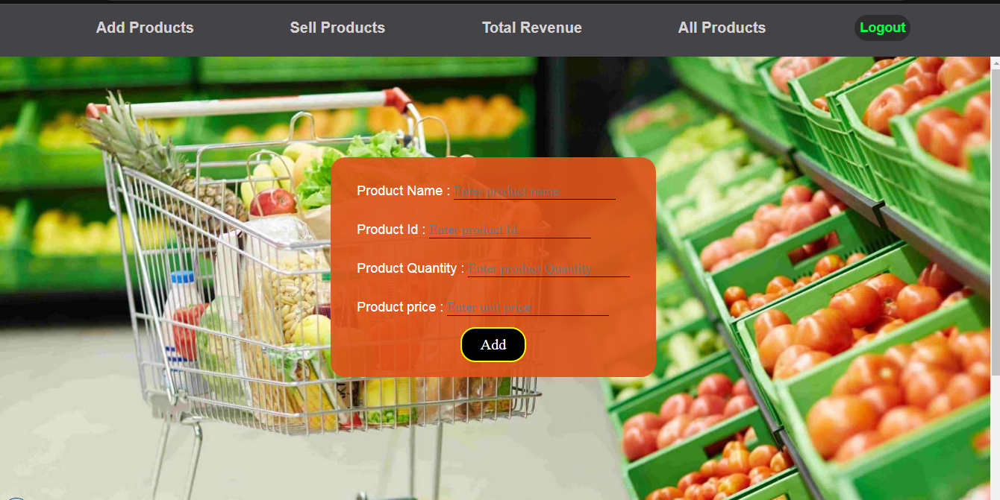
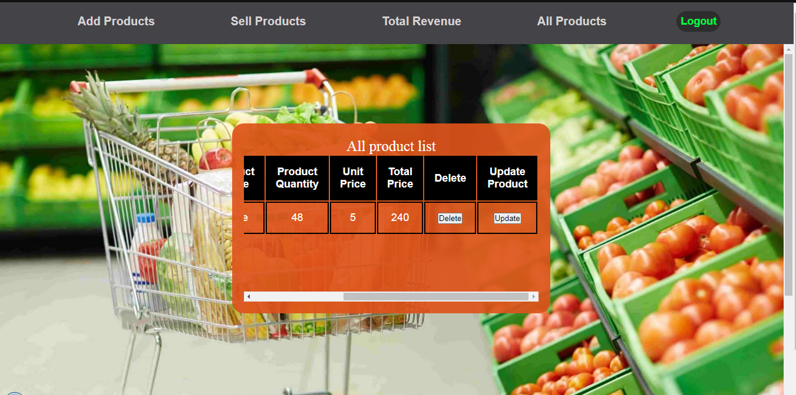
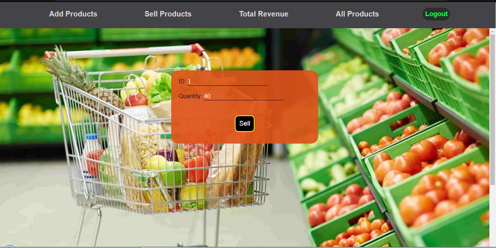
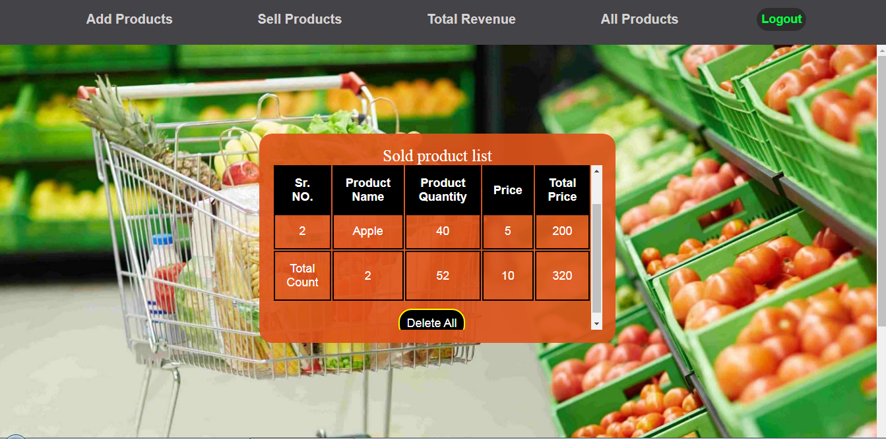

# Grocery Management System

Academic project (DBMS coursework – 2nd Year) showcasing a Grocery Management System built with Node.js, Express, and SQLite. Includes features for product inventory, sales tracking, and revenue dashboards. Demonstrates practical application of SQL, CRUD operations, and full-stack development concepts.

---

## Table of Contents

- [Features](#features)
- [Screenshots](#screenshots)
- [Technologies Used](#technologies-used)
- [Project Structure](#project-structure)
- [API Endpoints](#api-endpoints)
- [How to Run](#how-to-run)
- [Default Login Credentials](#default-login-credentials)

## Features

- **User Authentication:** Secure login system to protect the management interface.
- **Product Management:** Add, update, and delete products from the inventory.
- **Inventory Control:** Track product quantities and prices.
- **Sales Tracking:** Record product sales and update inventory automatically.
- **Revenue Calculation:** View sold products and calculate total revenue.
- **Modern UI:** Responsive, interactive single-page application.

---

## Screenshots

|                 Add Products                  |                 All Products                  |                  Sell Products                  |                  Total Revenue                  |
| :-------------------------------------------: | :-------------------------------------------: | :---------------------------------------------: | :---------------------------------------------: |
|  |  |  |  |

---

## Technologies Used

**Backend:**

- Node.js
- Express.js
- sqlite3

**Frontend:**

- HTML, CSS, JavaScript

**Database:**

- SQLite

---

## Project Structure

```
grocery-management-system/
├── database.db
├── index.js
├── package.json
├── README.md
├── public/
│   ├── fetchh.js
│   ├── index.html
│   ├── product_box.css
│   ├── script.js
│   ├── style.css
│   ├── images/
│   │   ├── backgroundImg.jpg
│   │   └── groceryBackgroundImage.jpg
│   └── login/
│       ├── loginPage.html
│       ├── script.js
│       ├── style.css
│
├── screenshots/
│   ├── add_products.png
│   ├── all_products.png
│   ├── sell_products.png
│   └── total_revenue.png
```

---

### File-by-File Breakdown

- **`api/`**: This directory contains all the backend code.

  - **`index.js`**: The main backend file that sets up the Express server, connects to the SQLite database, and defines all API endpoints.
  - **`package.json`**: Contains backend project metadata, dependencies, and scripts.
  - **`database.db`**: The SQLite database file.

- **`public/`**: This directory contains all the frontend files that are served to the client.
  - **`index.html`**: The main application page for managing groceries.
  - **`login/loginPage.html`**: The initial login page for user authentication.
  - **`*.css`**: CSS files for styling the application.
  - **`*.js`**: JavaScript files for UI interactivity and API communication.
  - **`images/`**: Contains images for the application's frontend.

---

## API Endpoints

| Method | Endpoint                | Description                                    |
| ------ | ----------------------- | ---------------------------------------------- |
| POST   | `/login`                | Authenticates a user.                          |
| GET    | `/products`             | Fetches all available products.                |
| POST   | `/product/add`          | Adds a new product to the inventory.           |
| PATCH  | `/product/update`       | Updates an existing product.                   |
| DELETE | `/product/delete/:id`   | Deletes a specific product.                    |
| DELETE | `/products/delete`      | Deletes all products.                          |
| GET    | `/sold-products`        | Retrieves all sold products.                   |
| POST   | `/sold-product/add`     | Marks a product as sold and updates inventory. |
| DELETE | `/sold-products/delete` | Clears all sold products.                      |

---

## How to Run

1. **Clone the repository:**
   ```bash
   git clone <repository-url>
   cd grocery-management-system
   ```
2. **Install dependencies:**
   ```bash
   npm install
   ```
3. **Start the server:**
   ```bash
   npm run dev
   ```
4. **Open your browser:**
   Go to [http://localhost:8080/login](http://localhost:8080/login)

---

## Default Login Credentials

For initial access, use:

- **Username:** `user`
- **Password:** `123`
